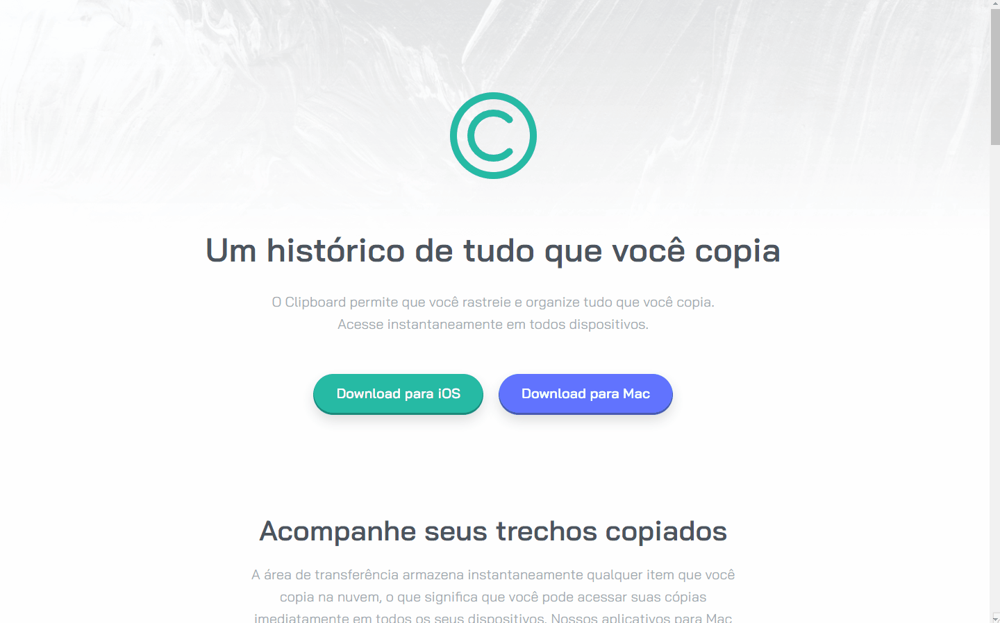

# Clipboard landing page

Repositório do challenge [Clipboard landing page](https://www.frontendmentor.io/challenges/clipboard-landing-page-5cc9bccd6c4c91111378ecb9) da plataforma Frontend Mentor.

## 📁 Detalhes do projeto

	

 

A proposta deste desafio foi desenvolver a landing page do app Clipboard usando HTML e CSS.

Com base no protótipo disponibilizado no Figma a aplicação deveria se adaptar aos diversos tamanhos de tela e alguns elementos deveriam receber estilizações específicas em seu estado de foco.

	

 

Para desenvolver o projeto a abordagem utilizada foi o mobile-first e depois segui com os ajustes necessários. O layout do Figma previa o design para mobile com 375px e para desktop com 1440px, mas optei por adaptar também para tablet, telas intermediárias e maiores.  

Usei as media queries com min-width de 900px e 1500px. Apesar de não serem medidas padrões, se mostraram mais eficazes para garantir um layout mais responsivo.

	

 

Para os ícones de redes sociais usei o Font Awesome e apliquei os estados de foco. Também estilizei o hover dos botões e da lista do rodapé.

	

 

## 👩‍💻 Tecnologias utilizadas

	
	

Desenvolvido com 💙 por [Juliana Lucca](https://www.linkedin.com/in/julianalucca/).